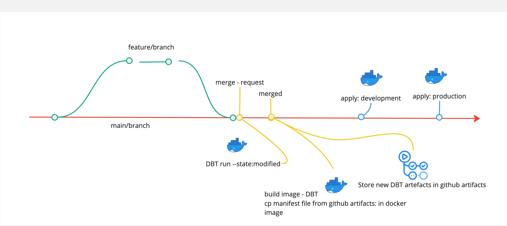

# CI/CD for DBT Football Analytics Project

This repository contains the CI/CD workflows for the DBT Football Analytics project. These workflows automate the process of building, testing, and deploying your DBT models using Docker containers. Below is a summary of the workflows included in this repository:

## Workflows

### 1. DBT run new models in DOCKER

- **Purpose:** Builds and runs DBT models in a Docker container for new model development.
- **Trigger:** Runs on pull request events but only for the "main" branch, or manually triggered from the Actions tab.
- **Steps:**
  - Checks out the repository.
  - Sets up Python environment.
  - Installs Docker and dependencies.
  - Builds Docker image for DBT.
  - Downloads DBT artifacts.
  - Copies artifacts to Docker container.
  - Logs in to Docker Hub.
  - Pushes Docker image with artifacts.
  - Pulls Docker image with artifacts.
  - Runs DBT commands in a Docker container.

### 2. DBT Load Artifacts

- **Purpose:** Downloads DBT artifacts from a previous workflow run and uploads them as artifacts for later use.
- **Trigger:** Runs when a pull request is closed or manually triggered from the Actions tab.
- **Steps:**
  - Checks out the repository.
  - Sets up Python environment.
  - Installs dependencies.
  - Compiles and runs DBT models.
  - Uploads resulting artifacts.
  
### 3. Run DBT in DOCKER build for DEV

- **Purpose:** Runs DBT models in a Docker container for development environment.
- **Trigger:** Manually triggered from the Actions tab.
- **Steps:**
  - Checks out the repository.
  - Sets up Python environment.
  - Installs Docker and dependencies.
  - Logs in to Docker Hub.
  - Pulls Docker image for development.
  - Runs DBT commands in a Docker container.

### 4. Run DBT in DOCKER build for Prod

- **Purpose:** Runs DBT models in a Docker container for production environment.
- **Trigger:** Manually triggered from the Actions tab.
- **Steps:**
  - Checks out the repository.
  - Sets up Python environment.
  - Installs Docker and dependencies.
  - Logs in to Docker Hub.
  - Pulls Docker image for production.
  - Runs DBT commands in a Docker container.

### 5. DBT deploy prod in DOCKER

- **Purpose:** Deploys DBT models to production environment using Docker containers.
- **Trigger:** Manually triggered from the Actions tab.
- **Steps:**
  - Checks out the repository.
  - Sets up Python environment.
  - Installs Docker and dependencies.
  - Logs in to Docker Hub.
  - Pulls Docker image for development.
  - Tags and pushes Docker image for production.

## Usage

1. Ensure that necessary secrets (`DBT_ACCOUNT_FOOTBALL`, `DBT_PASSWORD_FOOTBALL`, `DBT_DOCKER`) are configured in your GitHub repository settings.
2. Manually trigger the appropriate workflow from the Actions tab based on your development or production needs.
3. Monitor workflow runs for any errors or failures.
